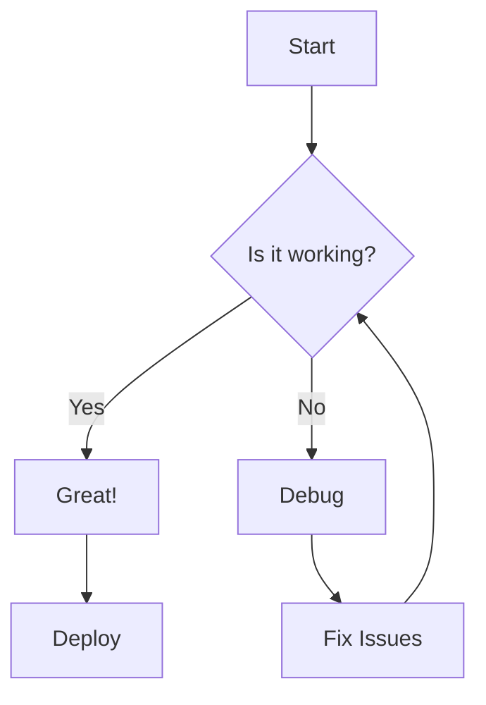
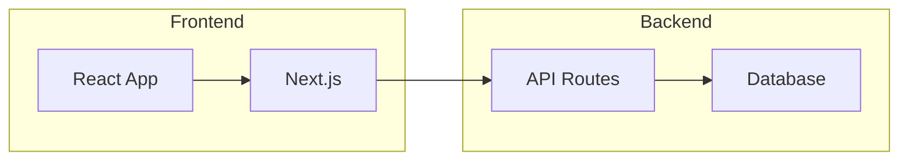
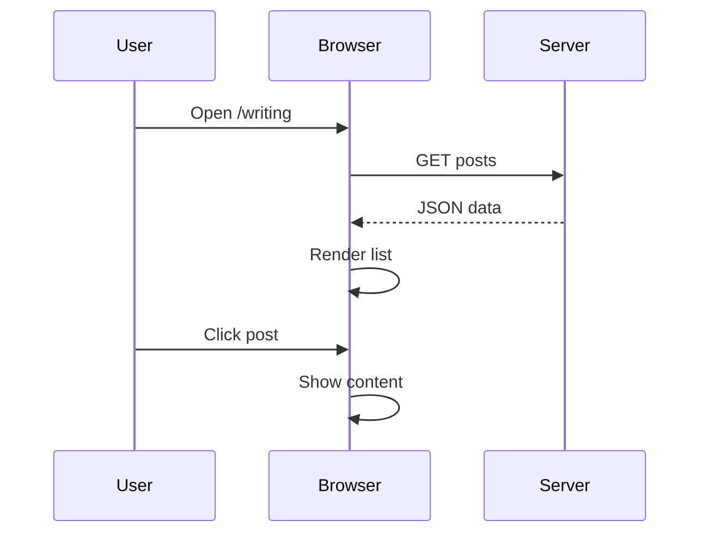

## Mermaid Diagrams

Our blog now supports **Mermaid** diagrams directly in Markdown code blocks. Just write:



## Flowchart Example



## Sequence Diagram



## Code Highlighting

With **Shiki** (rehype-pretty-code), code blocks look stunning:

```typescript
// Example: Blog post loader
async function getPost(slug: string): Promise<Post | null> {
  const content = await readFile(`writing/${slug}.md`)
  if (!content) return null
  
  const { meta, body } = parseFrontmatter(content)
  return { meta, content: body }
}
```

## Tables

| Feature | rehype-highlight | rehype-pretty-code (Shiki) |
|---------|-----------------|---------------------------|
| Quality | Good | Best (VS Code) |
| Languages | ~190 | 200+ |
| Themes | Few | VS Code themes |
| Line numbers | No | Yes |
| Highlight lines | No | Yes |
| Server render | Yes | Yes |
