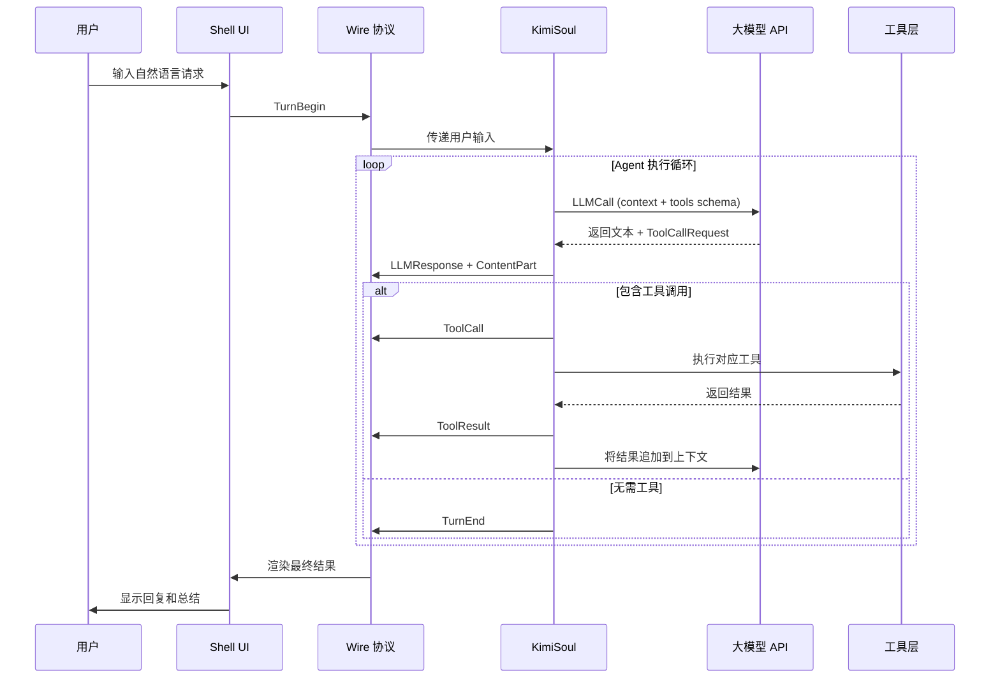

# Kimi CLI 功能架构完全分析报告

> 模块拆解、交互机制、执行流程与对外扩展能力全景解析

---

## 一、产品定位与核心架构

Kimi CLI 是 Moonshot AI 推出的**终端原生 AI Agent 开发环境**。它不仅仅是一个「命令行版 ChatGPT」，而是一个具备完整感知-决策-执行闭环的 Agent 操作系统。

其核心设计哲学是：
> **让 AI 不只是对话，而是能直接读取文件、执行命令、调用外部工具、操作浏览器，并在人类的监督下完成真实任务。**

### 1.1 整体架构图

```
┌─────────────────────────────────────────────────────────────────────────┐
│                           用户交互层 (UI Layer)                          │
│  Shell 模式 │ Print 模式 │ ACP 模式 │ Wire 模式 │ Web UI │ Vis 追踪可视化 │
├─────────────────────────────────────────────────────────────────────────┤
│                           会话管理层 (Session Layer)                     │
│  Session → Context (context.jsonl) + Wire (wire.jsonl) + State          │
├─────────────────────────────────────────────────────────────────────────┤
│                           Agent 执行引擎 (Soul Engine)                   │
│  KimiSoul → Agent Runtime → LLM 循环 → Toolset → 审批流 → Hook 系统     │
├─────────────────────────────────────────────────────────────────────────┤
│                           工具生态层 (Tool Layer)                        │
│  内置工具 (File/Shell/Web/Agent/Think/Plan/Todo/AskUser...)              │
│  MCP 工具 (外部 MCP Servers 动态加载)                                    │
│  Skill 工具 (SKILL.md 描述的自定义能力)                                  │
├─────────────────────────────────────────────────────────────────────────┤
│                           扩展连接层 (Extension Layer)                   │
│  Skills / MCP / Hooks / Subagents / Plugins / Background Tasks          │
└─────────────────────────────────────────────────────────────────────────┘
```

---

## 二、模块拆解：八大核心子系统

### 2.1 `app.py` —— 应用入口与生命周期 orchestrator

`KimiCLI` 类是整个应用的「导演」。它负责：
- 加载配置 (`Config`)
- 初始化 LLM (`create_llm`)
- 创建或恢复 `Session`
- 构建 `KimiSoul` 运行时
- 启动对应的 UI 模式

**关键方法**：
- `KimiCLI.create()`：工厂方法，组装所有依赖
- `KimiCLI.run_shell()`：启动交互式 Shell（最常见）
- `KimiCLI.run_print()`：单次执行模式（`--print`）
- `KimiCLI.run_acp()`：IDE 集成模式（Agent Communication Protocol）

### 2.2 `session.py` / `session_state.py` / `session_fork.py` —— 会话管理三件套

| 模块 | 职责 |
|------|------|
| `session.py` | 定义 `Session` 数据结构，关联 `work_dir`、`context_file`、`wire_file`、`state` |
| `session_state.py` | 持久化会话状态（YOLO 模式、Plan 模式、工作区范围、已添加目录） |
| `session_fork.py` | 实现 `/fork` 和 `/undo` 的分支机制，让会话可以像 Git 分支一样分岔和回退 |

**核心洞察**：Kimi CLI 的会话不是简单的「聊天记录」，而是一个**具备版本控制能力的状态容器**。

### 2.3 `soul/` —— Agent 执行引擎（心脏）

这是 Kimi CLI 最核心的模块群，相当于 Agent 的「大脑 + 神经系统」。

#### `soul/kimisoul.py` —— `KimiSoul` 主类

`KimiSoul` 是执行循环的 orchestrator。它的核心方法是 `run()`，驱动整个 LLM-Agent 循环：

```python
# 伪代码表示执行循环
while not done:
    1. StepBegin → 通知 UI 新步骤开始
    2. LLMCall → 调用大模型，获取回复（可能包含 reasoning/thinking）
    3. 解析回复 → 提取文本内容 + ToolCallRequest
    4. 审批检查 → 如果需要，向用户请求批准
    5. ToolExecution → 调用对应工具（Shell/WriteFile/Agent/...）
    6. ToolResult → 将结果返回给 LLM
    7. 重复直到 LLM 不再请求工具
```

**关键子模块**：
| 文件 | 功能 |
|------|------|
| `kimisoul.py` | 主执行循环、LLM 调用、Step 管理、上下文压缩触发 |
| `agent.py` | `Runtime` 运行时、`Agent` 定义、动态注入系统提示词 |
| `context.py` | `Context` 类，管理对话历史的追加、Checkpoint、系统提示词重写 |
| `toolset.py` | `KimiToolset`，工具注册、查找、MCP 服务器加载、Hook 调用 |
| `approval.py` | 审批流逻辑，处理 Human-in-the-loop |
| `compaction.py` | 上下文压缩算法，防止 token 超限 |
| `slash.py` | 斜杠命令注册表（`/init`, `/compact`, `/clear` 等） |
| `btw.py` | 侧边提问（`/btw`）的隔离上下文实现 |

### 2.4 `tools/` —— 内置工具库

Kimi CLI 提供了一套完整的原生工具，每个工具都是一个独立的 Python 包：

| 工具目录 | 工具名 | 功能 |
|----------|--------|------|
| `tools/file/` | ReadFile, WriteFile, StrReplaceFile, Glob, Grep, ReadMediaFile | 文件系统操作 |
| `tools/shell/` | Shell, TaskList, TaskOutput, TaskStop | 命令执行与后台任务管理 |
| `tools/web/` | SearchWeb, FetchURL | 网络搜索与网页抓取 |
| `tools/agent/` | Agent | 子 Agent 调用（并发/串行） |
| `tools/plan/` | Plan | Plan 模式提案与审批 |
| `tools/think/` | Think | 让 AI 进行显式思考（不执行动作） |
| `tools/ask_user/` | AskUserQuestion | 向用户提问并等待回答 |
| `tools/todo/` | SetTodoList | 任务列表管理 |
| `tools/dmail/` | SendDMail | 发送邮件通知（内部功能） |
| `tools/background/` | Background Shell/Agent 支持 | 后台任务相关 |

**工具注册机制**：所有工具在 `tools/__init__.py` 中通过 `extract_key_argument()` 提供参数摘要，便于 UI 展示。

### 2.5 `wire/` —— 通信协议层

`Wire` 是连接 **Soul 引擎** 和 **UI 层** 的「神经突触」。它基于**发布-订阅（BroadcastQueue）**模式：

```
Soul Side (WireSoulSide) ──→ BroadcastQueue ──→ UI Side (WireUISide)
                                │
                                └──→ WireFile (持久化到 wire.jsonl)
```

**Wire 消息类型**（在 `wire/types.py` 中定义）：
- `TurnBegin/End`：一轮用户对话的开始和结束
- `StepBegin/End`：一个 Agent 步骤的开始和结束
- `LLMCall/Response`：LLM 调用事件和返回事件
- `ToolCall/ToolResult`：工具调用请求和结果
- `ContentPart`：流式文本/thinking 内容
- `ApprovalRequest/Response`：审批请求和响应
- `StatusUpdate`：状态更新（token 用量、上下文压缩等）

**核心价值**：`wire.jsonl` 完整记录了从用户输入到任务结束的**每一个原子事件**，是调试、审计、二次开发的数据金矿。

### 2.6 `ui/` —— 多模态用户界面层

Kimi CLI 不是只有一个「终端界面」，而是支持多种 UI 模式：

| 模式 | 模块 | 适用场景 |
|------|------|----------|
| **Shell** | `ui/shell/` | 交互式终端（最常见） |
| **Print** | `ui/print/` | 单次执行，输出到 stdout（`--print`） |
| **ACP** | `ui/acp/` | IDE 集成（Zed、JetBrains 等） |
| **Wire** | `ui/` (间接) | 程序化调用，输出 JSONL 流 |
| **Web UI** | `web/` | 浏览器界面（`/web` 命令启动） |
| **Vis** | `vis/` | 可视化追踪器（`/vis` 命令启动） |

`ui/shell/` 内部还包含：
- 输入框编辑（支持 `Ctrl-O` 调用外部编辑器）
- Live 区域（实时显示 thinking 流和工具执行状态）
- Diff 高亮（文件修改预览）
- 任务浏览器（`/task` 命令的 TUI）
- 主题系统（深色/浅色）

### 2.7 `skill/` —— Skill 发现与加载系统

Skill 是 Kimi CLI 的**能力扩展包**。Skill 系统负责：
- 扫描多个候选目录（用户级 `~/.kimi/skills/`、项目级 `./.kimi/skills/`、通用 `~/.config/agents/skills/`）
- 解析 `SKILL.md` 的 YAML frontmatter
- 区分 **Standard Skill** 和 **Flow Skill**
- 通过 `/skill:<name>` 或 `/flow:<name>` 斜杠命令注入到上下文中

**Flow Skill**：在 `SKILL.md` 中内嵌 Mermaid/D2 流程图，Agent 会按流程图节点顺序执行（`BEGIN → 节点1 → 节点2 → END`）。

### 2.8 `background/` + `subagents/` —— 并发与协作层

| 模块 | 功能 |
|------|------|
| `background/` | 管理后台 Shell/Agent 任务的生命周期（启动、监控、停止、通知） |
| `subagents/` | 子 Agent 实例的存储、调度、状态追踪 |

**后台任务机制**：
- 通过 `Shell(run_in_background=True)` 或 `Agent(run_in_background=True)` 启动
- 主 Agent 继续执行，后台任务在独立进程中运行
- 完成后通过通知系统告知主 Agent
- `/task` 命令提供 TUI 浏览器管理所有任务

---

## 三、交互机制：用户输入如何变成代码执行？

### 3.1 标准交互流程（Shell 模式）



### 3.2 审批机制（Approval Runtime）

当 Agent 要执行敏感操作时（如 `WriteFile`、`Shell`），Kimi CLI 会进入**审批流**：

1. `KimiSoul` 检测到需要审批的工具调用
2. 通过 `Wire` 发送 `ApprovalRequest` 到 UI
3. UI 弹出确认框，显示工具的参数和潜在风险
4. 用户选择 **Approve / Reject / Edit**
5. `ApprovalResponse` 通过 `Wire` 返回 Soul
6. 只有获得批准后才真正执行工具

**YOLO 模式**：用户可以通过 `/yolo` 开启自动审批，跳过所有确认（适合可信环境）。

### 3.3 Plan 模式的特殊交互

Plan 模式（`/plan`）是一种**只读探索 + 人类审批**的协作模式：

1. 用户开启 Plan 模式
2. Agent 只能使用只读工具（`ReadFile`、`Glob`、`Grep`、`SearchWeb`）探索代码库
3. Agent 将实施方案写入 plan 文件
4. 用户审查方案后选择 **Approve / Reject / Revise**
5. 批准后，Agent 才能进入正常的读写执行模式

这是 Kimi CLI 区别于其他 CLI Agent 的**核心设计特色**——在执行前先建立共识。

---

## 四、工作流程：从启动到任务完成的完整链路

### 4.1 启动阶段

```bash
kimi [options] [prompt]
```

1. **解析 CLI 参数**：`--config-file`, `--model`, `--thinking`, `--yolo`, `--work-dir`, `--print`, `--agent-file` 等
2. **加载配置**：`~/.kimi/config.toml`（TOML/JSON 兼容）
3. **初始化日志**：`~/.kimi/logs/kimi.log`
4. **创建/恢复 Session**：
   - 如果是 `-r <session-id>`，恢复已有会话
   - 否则在工作目录下创建新 `Session`
5. **加载 Agent Spec**：默认 `agents/default/agent.yaml`，或 `--agent-file` 指定的自定义 Agent
6. **构建 KimiSoul**：组装 `Runtime` + `Context` + `Toolset` + `Wire`
7. **加载 Skills 和 MCP**：扫描 Skill 目录，异步连接 MCP Servers
8. **启动 UI**：进入 Shell / Print / ACP / Wire 模式

### 4.2 执行阶段（单次用户请求）

1. **用户输入预处理**：
   - 识别斜杠命令（`/export`, `/skill:xxx`, `/plan` 等）
   - 如果是斜杠命令，直接由 `SlashCommandRegistry` 处理
   - 否则进入 Soul 执行循环

2. **Soul 执行循环**（`KimiSoul.run()`）：
   - `StepBegin` → 标记新步骤开始
   - 调用 LLM（`llm.chat_completion()`），传入当前上下文和可用工具 schema
   - LLM 返回流式响应，实时通过 `Wire` 发送到 UI
   - 解析响应：提取 `ContentPart`（文本/thinking）和 `ToolCallRequest`
   - **Checkpoint**：在关键节点写入 `context.jsonl`
   - 如果需要工具调用，进入审批流（除非 YOLO 模式）
   - 执行工具，获取 `ToolResult`
   - 将结果追加到 `Context`
   - 重复循环直到 LLM 不再调用工具

3. **上下文压缩**（Compaction）：
   - 当 `context_tokens >= max_context_size * compaction_trigger_ratio`（默认 0.85）时
   - `compaction.py` 将早期对话历史压缩为摘要
   - 释放 token 空间，保证长会话可持续性

4. **TurnEnd**：
   - 标记本轮结束
   - 更新 `user-history` 和会话元数据

### 4.3 关闭与恢复阶段

- **正常退出**：`/exit` 或 `Ctrl-D`
  - 所有数据已持久化到 `context.jsonl` 和 `wire.jsonl`
  - 后台任务根据配置决定是否保留
- **异常退出**：如工作目录被删除
  - Kimi CLI 会捕获异常，显示崩溃报告（含 session ID），干净退出
- **会话恢复**：`kimi -r <session-id>`
  - 读取 `context.jsonl` 恢复完整对话历史
  - 读取 `state.json` 恢复 YOLO/Plan 等模式状态
  - 从 Checkpoint 处继续执行

---

## 五、对外扩展机制：四大扩展点

Kimi CLI 的扩展性是其架构设计中最出色的部分。它提供了**四个不同层次的扩展机制**，覆盖了从简单 Prompt 注入到复杂外部系统集成的全谱系需求。

### 5.1 扩展点 1：Skills（能力包）

**定位**：通过 Markdown 文件为 Agent 注入领域知识和操作规范。

**技术规范**：
- 入口文件必须是 `SKILL.md`
- 支持 YAML frontmatter：
  ```yaml
  ---
  name: your-skill-name
  description: 一句话描述触发场景
  supported_agents: [claude-code, kimi, codex, opencode]
  ---
  ```
- 支持两种类型：
  - **Standard Skill**：将 Markdown 内容作为 system prompt 注入
  - **Flow Skill**：内嵌 Mermaid/D2 流程图，Agent 按节点顺序执行

**加载路径优先级**（从高到低）：
1. 项目级品牌目录：`./.kimi/skills/` > `./.claude/skills/` > `./.codex/skills/`
2. 项目级通用目录：`./.agents/skills/`
3. 用户级品牌目录：`~/.kimi/skills/` > `~/.claude/skills/` > `~/.codex/skills/`
4. 用户级通用目录：`~/.config/agents/skills/` > `~/.agents/skills/`
5. 内置 Skills：Kimi CLI 自带的基础 Skills

**使用方式**：
```bash
/skill:github-task-workflow
/flow:code-review
```

### 5.2 扩展点 2：MCP（Model Context Protocol）

**定位**：通过标准化协议连接外部工具和数据源（被誉为 "AI 的 TCP/IP"）。

**Kimi CLI 中的 MCP 实现**：
- 配置文件：`~/.kimi/mcp.json`（全局）
- 管理命令：`kimi mcp list`, `kimi mcp test`, `kimi mcp add`, `kimi mcp auth`
- 传输方式：`stdio`（本地进程）和 `http`（远程服务）
- 超时配置：`config.toml` 中 `[mcp.client] tool_call_timeout_ms = 60000`

**MCP 工具加载流程**：
1. Kimi CLI 启动时异步读取 `mcp.json`
2. 为每个 MCP Server 建立连接（stdio 子进程 或 HTTP SSE）
3. 调用 `tools/list` 获取该 Server 提供的工具 schema
4. 将工具注册到 `KimiToolset`
5. LLM 的 function calling schema 中自动包含这些外部工具
6. Agent 调用时，通过 JSON-RPC 转发到对应 MCP Server

**常见 MCP 集成场景**：
- 浏览器自动化（Playwright MCP）
- 数据库查询（PostgreSQL MCP）
- 文件系统访问（Filesystem MCP）
- 版本控制（GitHub MCP）
- 知识库搜索（Notion / Obsidian MCP）

### 5.3 扩展点 3：Hooks（生命周期钩子）

**定位**：在 Agent 执行的关键节点插入自定义脚本（Beta 功能）。

**配置方式**（`config.toml`）：
```toml
[[hooks]]
event = "PreToolUse"
matcher = "Shell"
command = ".kimi/hooks/safety-check.sh"
timeout = 10

[[hooks]]
event = "PostToolUse"
matcher = "WriteFile"
command = "prettier --write"
```

**支持的事件类型**：
- `PreToolUse`：工具执行前
- `PostToolUse`：工具执行后
- `Stop`：会话停止时

**典型用途**：
- 安全审计（执行 Shell 前进行风险扫描）
- 代码格式化（WriteFile 后自动运行 prettier）
- 自定义通知（重要操作后发送邮件/Slack）

### 5.4 扩展点 4：Subagents（子 Agent）

**定位**：通过 `Agent` 工具启动并行的专业化子 Agent 实例。

**工作机制**：
1. 主 Agent 调用 `Agent` 工具，传入 `description` 和 `prompt`
2. `KimiSoul` 创建一个新的子 Agent 实例（可能使用不同的 Agent Spec）
3. 子 Agent 在独立的上下文中执行任务
4. 完成后将结果返回给主 Agent
5. 子 Agent 实例被持久化到 `~/.kimi/sessions/<hash>/<session_id>/subagents/`

**关键特性**：
- **状态持久化**：子 Agent 有自己的 session ID，可以跨主 Agent 会话恢复
- **并发执行**：多个 `Agent` 工具调用可以并行启动多个子 Agent
- **前景/后台模式**：`run_in_background=true` 时子 Agent 变为后台任务

---

## 六、扩展能力对比矩阵

| 扩展机制 | 难度 | 适用场景 | 实时性 | 生态成熟度 |
|----------|------|----------|--------|------------|
| **Skills** | 极低 | Prompt 注入、工作流规范、领域知识 | 即时加载 | ⭐⭐⭐⭐⭐ |
| **Hooks** | 低 | 安全审计、自动化后处理 | 即时触发 | ⭐⭐⭐☆☆ |
| **Subagents** | 中 | 复杂任务分解、并发执行 | 同步/异步 | ⭐⭐⭐⭐☆ |
| **MCP** | 中-高 | 连接外部系统、数据库、SaaS | 依赖网络 | ⭐⭐⭐⭐⭐ |
| **Plugins** | 高 | 深度定制 UI、修改核心行为 | 需重启 | ⭐⭐☆☆☆ |

---

## 七、关键技术洞察

### 7.1 "Soul" 命名的深意

`KimiSoul` 不仅是执行引擎的名字，它代表了 Kimi CLI 的架构哲学：
- **Context（上下文）** = 记忆
- **Toolset（工具集）** = 感官与四肢
- **Wire（协议）** = 神经系统
- **LLM（大模型）** = 大脑皮层
- **Approval（审批）** = 人类监督的良知

这五部分组成了一个完整的「数字灵魂」。

### 7.2 为什么 `wire.jsonl` 如此重要？

`wire.jsonl` 不只是日志，它是**可重放、可分析、可调试的协议级记录**。未来可能基于此构建：
- 自动测试框架（重放 Wire 事件验证 Agent 行为一致性）
- 可视化调试器（`/vis` 已经实现了一部分）
- 性能分析工具（统计每个 Step 的耗时、Token 消耗）
- 安全审计系统（追踪所有工具调用和审批决策）

### 7.3 多 UI 模式的设计智慧

Kimi CLI 同时支持 Shell、Print、ACP、Wire、Web、Vis 六种模式，这让它能够：
- **面向人类**：Shell / Web 提供直观的交互体验
- **面向机器**：Print / Wire / ACP 提供可编程的接口
- **面向开发者**：Vis 提供深度的可视化调试

这种设计使 Kimi CLI 既是**终端用户的生产力工具**，也是**开发者的基础设施平台**。

---

## 八、总结：Kimi CLI 是什么，不是什么

### Kimi CLI 是：
- 一个**终端原生的 Agent 操作系统**，而不仅仅是对话机器人
- 一个**可扩展的开发者平台**，通过 Skills/MCP/Hooks/Subagents 四层机制支持深度定制
- 一个**可审计的执行环境**，所有思考过程、工具调用、审批决策都被完整记录
- 一个**人机协作框架**，用 Plan 模式和 Approval Runtime 在自动化与人类监督之间找到平衡

### Kimi CLI 不是：
- 不是一个简单的「命令行版 ChatGPT」
- 不是一个封闭的黑盒系统（它的扩展点设计非常开放）
- 不是一个全自动、无需监督的 Agent（它在关键节点强制要求人类审批）

---

*报告生成时间：2026-04-17*  
*分析来源：Kimi CLI 官方文档 + 本地源码结构分析（v0.10+）*  
*核心框架：Soul Engine + Wire Protocol + Multi-Mode UI + 4-Layer Extension*
