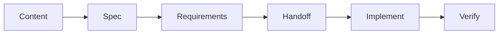

# Task Docs Workflow — Content → Spec → Requirements → Handoff → Verify

> Status: design  
> Paths: `task/project/`, `task/issues/`  
> Output for solutions: `docs/solution/`

## Goal

用文档驱动开发：需求与上下文写在 `task/`，AI / 人按固定文档阶段推进，产物与验证可追踪，无需依赖聊天记忆。

## Directory Layout

```
task/
├── project/                    # 产品 / 跨模块需求（Program / Epic）
│   ├── project-overview.md     # 项目定位（本仓库已有）
│   └── <slug>/
│       ├── README.md           # 需求索引（状态、任务列表）
│       ├── content.md          # Content：动机、用户故事、范围
│       ├── spec.md             # Spec：技术设计、接口、约束
│       ├── requirements.md     # 可验收需求条目（REQ-xxx）
│       ├── handoff.md          # Handoff：给执行 Agent 的简报
│       ├── verify.md           # Verify：验收清单与证据
│       ├── context/            # 见 multi-agent-context.md
│       │   ├── system.md
│       │   ├── requirement.md
│       │   └── interaction.md
│       └── tasks/
│           ├── T01-<slug>.md
│           └── T02-<slug>.md
├── issues/                     # 可执行工作单元（Issue / Task）
│   └── <id>-<slug>.md          # 或指向 project/.../tasks/Txx
└── tracing/                    # Local Workflow 追踪（可选）
```

约定：

| 目录 | 用途 |
|------|------|
| `task/project/` | 一个「需求」或「专题」的完整文档包 |
| `task/issues/` | 单任务入口；可独立存在，也可 `source: task/project/.../tasks/T01` |
| `docs/solution/` | 跨需求的方案沉淀（本文件所在处） |

## Document Stages

按顺序编写；后一阶段依赖前一阶段冻结的结论。



### 1. Content（`content.md`）

**写什么：** 为什么做、给谁用、成功长什么样（非实现细节）。

```markdown
# Content: <Title>

## Problem
...

## Audience / User
...

## Outcomes
- ...

## In Scope / Out of Scope
...

## References
- links, screenshots, prior docs
```

### 2. Spec（`spec.md`）

**写什么：** 怎么做（架构、数据流、文件触点、边界）。

```markdown
# Spec: <Title>

## Approach
...

## Architecture / Data Flow
...

## Touchpoints
| Area | Path | Change |
|------|------|--------|

## Constraints
- static export, a11y, bilingual, ...

## Open Questions
- [ ] ...
```

### 3. Requirements（`requirements.md`）

**写什么：** 可编号、可验收的条目（测试/人工均可勾选）。

```markdown
# Requirements: <Title>

| ID | Statement | Priority | Verify |
|----|-----------|----------|--------|
| REQ-01 | ... | P0 | verify.md#REQ-01 |
```

一条需求可拆多个任务（见下节）。

### 4. Handoff（`handoff.md`）

**写什么：** 给执行 Agent 的「开箱即读」简报——读哪些上下文、先做哪几个任务、禁止事项。

```markdown
# Handoff: <Title>

## Mission
One paragraph.

## Read first (ordered)
1. `context/system.md`
2. `context/requirement.md`
3. `content.md` + `spec.md` + `requirements.md`

## Task queue
| Task | File | Agent | Depends |
|------|------|-------|---------|
| T01 | tasks/T01-....md | main / sub | — |
| T02 | tasks/T02-....md | sub | T01 |

## Done when
- All P0 REQ verified in verify.md
```

### 5. Verify（`verify.md`）

**写什么：** 验收步骤、命令、证据位置。

```markdown
# Verify: <Title>

## Checklist
- [ ] REQ-01: ...
- [ ] Manual: nav shows only Content + Feed
- [ ] `pnpm --filter @innate/web build` (or equivalent)

## Evidence
| REQ | Evidence |
|-----|----------|
| REQ-01 | screenshot / log / PR link |
```

## Splitting One Requirement into Tasks

```
requirements.md          REQ-01, REQ-02, ...
        │
        ├─ tasks/T01-hide-nav.md      → covers REQ-01 (partial)
        ├─ tasks/T02-home-simplify.md → covers REQ-01 (partial)
        └─ tasks/T03-plugin-docs.md   → covers REQ-02
```

每个 `tasks/Txx-*.md` 最小字段：

```markdown
# T01: <title>

- **REQ**: REQ-01
- **Status**: todo | doing | done
- **Agent**: main | sub:<name>
- **Context**: system + requirement (+ interaction if listed)
- **Depends**: none | T00

## Goal
...

## Steps
1. ...

## Verify
- [ ] ...
```

## Mapping to Local / GitHub Workflow

| Stage | Local Workflow | GitHub Workflow |
|-------|----------------|-----------------|
| Start | `tracing.py init --task task/...` | Create Issue from handoff |
| Work | Implement from task file | Same + Issue comments |
| End | `tracing.py finish` + update `verify.md` | Close Issue + evidence |

## Agent Protocol (short)

执行某个 `task/project/<slug>/` 或 `task/issues/<file>` 时：

1. 读 `handoff.md`（若存在）否则读任务文件全文  
2. 按 handoff 的 Read-first 加载 `context/*`  
3. 只改任务范围内的文件  
4. 更新任务 Status + `verify.md` 勾选  
5. 方案类产出写入 `docs/solution/`（若 handoff 指定）

## Templates

可复制起步包：

```
task/project/_template/
  README.md
  content.md
  spec.md
  requirements.md
  handoff.md
  verify.md
  context/system.md
  context/requirement.md
  context/interaction.md
  tasks/.gitkeep
```

（实现阶段再落盘 `_template`；本方案先定契约。）

## Acceptance for This Doc Solution

- [x] `project/` vs `issues/` 职责清晰  
- [x] 五阶段文档职责与文件名固定  
- [x] 一需求多任务的拆分方式明确  
- [x] 与 Local Workflow / Agent 读序衔接  
- [x] 落地 `_template` 目录（`task/project/_template/`、`task/issues/_template.md`）  
