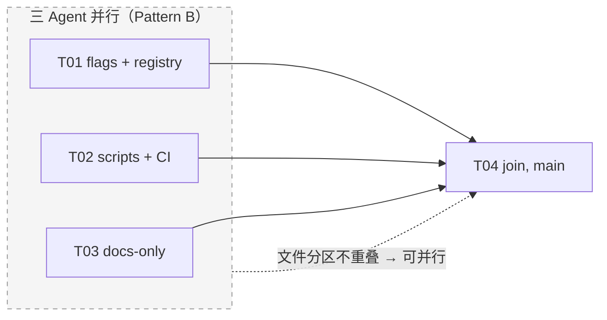

# Interaction Context: Refine（blog + plugin 验证落地）

涉及共享文件或并行的任务必读。

## Task graph

## Shared ownership

| Path | Owner task | Others |
|------|------------|--------|
| `apps/web/lib/site-features.ts` | T01 | read-only（含 plugin-mode 包） |
| `apps/web/lib/plugins/registry.ts` | T01 | read-only |
| `apps/web/scripts/verify-plugins.mjs` | T02 | read-only |
| `.github/workflows/verify-plugins.yml` | T02 | read-only |
| `apps/web/package.json`（scripts 段） | T02 | read-only |
| `docs/**`（本包新增文档） | T03 | append-only |
| `verify.md` / README 状态 | T04 | 其余任务只勾自己的行 |

## Contracts

- `SitePlugin` manifest（`apps/web/lib/plugins/types.ts`）：本包**不改类型**；verify-plugins 只消费不修改
- flag→消费方映射：T01 删除 `betterstackGuides`/`feed` 后——registry 引用集 = {making, cheatsheets, awesome}，shell 引用集 = {content}
- 断言分级开关：硬编码回归的 warn→fail 升级由 plugin-mode T05（或其 T01 落地后由本包 T02 顺手）执行，升级须在此登记

## Cross-package（与 plugin-mode 的交界）

| 冲突面 | 规则 |
|--------|------|
| `site-features.ts` + `registry.ts` | plugin-mode T01 也改这两个文件 → **本包 T01 必须先落地**；若 plugin-mode T01 已开工，则把死 flag 修复合入其首个 PR，勿双写 |
| 硬编码断言等级 | plugin-mode T01 落地前保持 warn；落地后升级 fail（见 Contracts） |
| `sidebar.tsx` / `header.tsx` / `app/page.tsx` | 本包只读——它们是 plugin-mode T01 的领地 |

## Conflict protocol

1. 同文件出现双写 → 停并行
2. 在下方登记冲突（路径 + 双方任务 + 说明）
3. main agent（T04 持有者）仲裁

## In progress

| Task | Agent | Started |
|------|-------|---------|
| | | |
